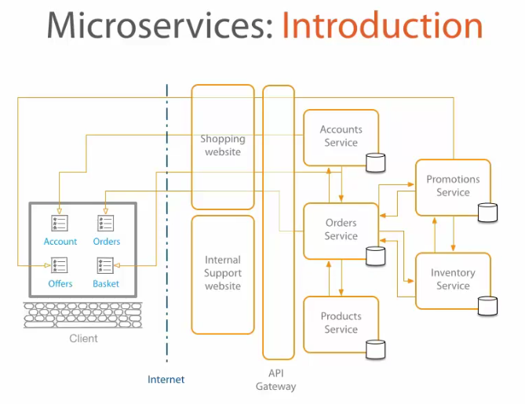

# Microservice Architecture

From [Microservices Architecture at Pluralsight](https://app.pluralsight.com/library/courses/microservices-architecture/table-of-contents)

## Introduction

### Why microservices?
To stay competitive, we need to be able to operate nimbly and efficiently. We do this by creating an environment where we can focus on supplying business features and allow us to iterate rapidly.

> "Software is eating the world."

We can create this type of environment by leveraging technologies and design practices centered on the software and developers who are creating the business value.

Microservices are not without their own share of challenges. Below are some of the unique challenges and considerations to be made when working with microservices.

### What are microservices?
Drawn in comparison to the Monolith where functionality all lived in one big software package. Microservices distribute functionality across smaller, self-contained components.

> e.g. e-Commerce system (Monolith) a single application which presents a UI to an end-user, contains business logic, handles transactions, communicates with databases. e-Commerce system (Microservice) has a UI component (or components) with individual software components for doing tasks like authentication, transaction processing.

The two important characteristic of microservices are that they are self-contained and loosely-coupled. They act as black boxes with everything they need to function contained within. They communicate to the outside world through well-defined interfaces but don't expose their inner mechanisms. This creates a type of isolation where microservices can have independent lifecycles: As long as they don't change how they behave externally, their technology stack or organization under the covers can be changed.

This modularity and independence of components has several benefits across the business.

  Benefit to architecture - modular, scalable, and self-contained
  Benefit to teams - clear ownership, simpler codebases, and small teams
  Benefit to business - move, fail, and win faster

Ultimate goal: independence and deployability of components

**TL;DR** - By splitting up applications into small pieces (microservices) which can be individually modified and deployed we can work faster, smarter, and better.

### Definitions
Service: A piece of software which provides functionality to other pieces of software (e.g. service which a webpage talks to)

Service oriented Architecture (SoA): Allows reuse and scaling of services by having multiple copies of service or allowing multiple types of software to leverage the service. 
  
Service design principles
  - Standardized contracts which don't change. 
  - Allows decoupling of implementation and interface
  - Stateless, software/users can talk to any instance of the service since they don't have to remember prior requests

Microservice architecture
  - Evolution of SoA to determine how to size/scale services
  - Set of design/organizational principles
  - Unchecked SoA can lead to monolith

Microservices
  - Small, with a single focus
  - Use lightweight (ideally open) communication mechanisms
  - Technology agnostic (use APIs)
  - Have independent data storage
  - Independently changeable & deployable
  - Have distributed transactions
  - Use centralized tooling for management

vs Monolithic
  - Large codebase without size restriction
  - Hard to onboard, develop, test, compile, and deploy
  - Hard to reuse and access individual features
  - Fixed tech stack
  - Scaling requires duplication of entire system

Why?
  - Faster response time
  - Decouple changing parts
  - Increased uptime & performance
  - Higher scalability
  - Better ownership and knowledge

Design principles
  1. High Cohesion
    a. Single focus & responsibility
    b. Related to a business function or domain
  2. Autonomous
    a. Honor contracts and interfaces
    b. A change to one service should not inflict change on another, backwards compatible
    c. Stateless
    d. Independently changeable & deployable
  3. Business Domain Centric
    a. Service should represent a business function or domain (bounded context in DDD)
    b. Responsive to business change
    c. Helps to define scope service
  4. Resilient
    a. Failure of a service should degrade or invoke default behavior but not break the system
    b. Plan for failure! (Chaos Monkey)
    c. Tricks
      i. Multiple instances & regionalities
      ii. Define default behaviors
      iii. Validate incoming data
  5. Observable
    a. There's a lot going on, how do we know where to look for problems?
    b. Need a centralized way to view system health
    c. Tooling for error detection, scaling, business intelligence
  6. Automated
    a. More complex systems and organizations require automation
    b. Automate as much as possible
      i. Unit/integration testing
      ii. Deployment
      iii. Scaling & maintenance
    c. Quick feedback loops
    d. Goal: high confidence!

High Cohesion
  - Identify a single focus (business function or domain)
  - Should have well defined input-outputs
  - Should have only one reason to change
  - Split into smaller services when the above are violated
  - Don't be afraid to make many services!

Autonomous: loosely coupled
  - Goal: independently deployable/changeable
  - Interface
     - Technology agnostic API
     - Fixed contracts
  - Communication
     - Synchronous: pingback to notify that request has been received to unblock
     - Asynchronous: use a message broker/queue for processing
     - Not "chatty," want to have few, well-defined communications so there's less risk of them changing
  - Resources
     - Don't want to share resources (databases, shared libraries)
  - In short: as little dependency/coupling between services so that changes cause as little outside impact as possible
  - Ownership by teams
  - Versioning
     - Avoid breaking changes, backwards compatibility honoring existing contracts
     - Use integration tests to confirm compatibility
     - Have a versioning strategy for breaking changes, maintain concurrent old/new versions
     - Use semantic versioning to make it apparent when changes are applied
      § Major - breaking changes
      § Minor - non-breaking change
      § Patch - defect fix

Business Domain Centric
  - Service should map to a business function or domain
  - Sizing strategy
    1. Start by course business domain mapping
    2. Identify subdomains/areas
    3. Review costs/benefits of splitting
    4. Agree on a common language
  - Okay to fix incorrect boundaries
     - Merge similar services
     - Split too-large a service
  - Non-domain reasons to split
     - Technical reasons
     - Performance reasons
     - CRUD functions

Resilient
  - Design for known failures (esp. failure of downstream systems)
     - Decide to degrade or default on failure
  - Fail & recover fast
     - Use timeouts and standardize between systems
  - Continuously monitor & log timeouts and issues to make transparent

Observable
  - Centralized monitoring system
     - Host: machine, CPU, memory, etc.
     - Services: response times, timeouts, exceptions, errors
     - BI data
  - Features:
     - Aggregation across multiple servers
     - Visualization
     - Trigger alerts
  - Centralized logging system
     - What happened and when?
     - Code milestones (startup, shutdown, request, response, decision trees)
     - Exceptions & errors
     - Consistent structure
      § Incl. service name, version, machine, time
      § Makes it queryable & aggregable
     - Correlation ID, a token which follows a request through the system

Automated
  - Continuous Integration (CI)
     - Unit test suites
     - Integration test suites
     - Culture: no errors in integration suites
     - Builds artifacts for CD tools
  - Continuous Development (CD)
     - Automate deployment process
     - Configure once, use everywhere!
     - Works with CI tools

Technologies
Communication (Synchronous)
  - RPC/REST over HTTP
Communication (Asynchronous)
  - Message Broker
  - Services don't talk to each other but put requests in a messaging queue
  - Makes it easy to spawn new microservices or have multiple

Hosting Platforms
  - Virtualization, including AWS
     - Easy to clone and replicate, but overhead of having an OS
  - Containers
     - Template for loading code onto an isolated environment in a preloaded OS
     - Faster, but emerging
  - Self-hosting
     - Buying your own shit

Registration and Discovery
  - Service registry database: on startup/shutdown services register/deregister presence on the network
  - More an issue for on-prem
  - Clients or gateway can be responsible for discovering/resolving location

Monitoring technologies
  - Metrics across servers
  - Standardized setup & automatic configuration
  - Alerting

Logging
  - Aggregate log data
  - Could also use a client logging library (e.g. Log4j) with a standardized template
  - Logs should follow a common structure for querying

Scaling
  - Meet increased demand by creating more instances or increasing host power
  - Automated or on-demand
  - Need a load-balancer or API gateway to distribute requests to multiple instances

Caching
  - Certain response/request pair scan be saved and returned in place of actual requests
  - At API gateway or proxy server (transparent to both client & server)
  - Client-side can work with local copies of data
  - Service-level, cache calls between services

API Gateways
  - Can work as a caching and/or load-balancing system
  - Single interface between services and applications
  - Used for resolving dynamic locations of services

Automation
  - CI tools
     - Look for: cross platform, integration with source control, notification services, IDE integrations, etc.
     - Repository and CI build process per microservice
  - CD tools
     - Look for: cross platform, scripting support, integration with CI tools, etc.

Migrating from Monolith (Brownfield)
1. Code
   1. Identify seams
    2. Begin modularizing & run unit tests to validate changes
    3. Once contexts are well defined, convert module into microservices
    4. Do one at a time and keep both versions online, switchable to reduce risk
    5. Incremental approach!
2. Database(s)
    1. Same idea as code, split one DB into multiple
    2. Use a data access layer to aggregate data appropriately as one database is split into multiple
3. Transactions
    1. More difficult in microservices architecture, distributed transactions, specifically what do we do with failed transactions?
      1. Retry
      2. Abort (undo transaction)
    2. Option to use transaction manager software but not a silver bullet
      1. Two-phase commit, creates a transaction but doesn't finalize until all stages are complete
4. Reporting
    1. Necessitates joining across more databases
    2. Options:
      1. Use a data reporting service
      2. Data dump to a single database

Migrating from Monolith (Greenfield)
1. Evolve domain and boundaries with business experts, more important to understand domain than what microservices are required
2. May be best to start with a monolith while seams are evolving
3. When enough stability is achieved, refactor into microservices

## Collaboration
Since working with microservices is a more distributed operation than working on a monolith, we have to focus on how we collaborate. We source control all our code in GitHub with a 1:1 relation of Microservice to repository. We also standardize on workflow for interacting with GitHub called GitHub Flow which is as follows:

1. Fork from EBSCOIS (upstream) to your own copy (origin)
2. Do your work in origin
   1. Create a branch for the user story/feature in origin
   2. Do work and push to origin
3. Send work to upstream
   1. Create a pull request (PR) to pull your changes into EBSCOIS/repo:develop and specify a reviewer
   2. Do code review inside PR
   3. Approve or close
   4. Delete branch
4. Pull changes from upstream and push to origin to synchronize repos

More in-depth: 

EBSCOIS has a canonical version of code. To work on some code create a fork, your own copy of the repository. GitHub knows that your repo is related to the EBSCOIS repo, a relation where the EBSCOIS repo is known as the upstream. This is where you can continue to get updates and where you will eventually return your changes to. You clone a copy of your repository to your local machine, a relationship where the copy on GitHub is conventionally called the origin. You do changes on a new branch, often based on a feature or user story. When changes are done, you push the changes to your own repository and open a pull request, where you formally ask for a code review and for your changes to be added to the canonical EBSCOIS repo.

The code in GitHub is also leveraged for activities like CI/CD, acting as a codebase for automated testing and deployments.

## Communication

To communicate between microservices, we choose to use light-weight, established, and technology-agnostic communication technologies.

HyperText Transport Protocol (HTTP), this fundamental protocol of the web is readily supported by all modern programming languages and environments. We can use HTTP requests to send information or issue commands over the web.

HTTP requests have a 4 parts:
  - URI - the location where the request is being made
  - Header - metadata about the request
  - Method/Verb - what action to perform on the request
  - Body/Payload - optionally provide data for the receiver to use

Responses to HTTP requests have a header, and body but also return
  - Status code - the result of the request encoded as a number
  (e.g. 200/OK, 201/Created, 405/Not Authorized)

To establish a standard way of talking over HTTP we use the Representational State Transfer (REST) design pattern. REST uses the elements of an HTTP request to make stateless calls to a service. Calls perform some operation, based on the HTTP method or verb, on an object, encoded with the request URI. They pass necessary data in the body of an HTTP request and are notified of the result through the returned status code.

All put together, we can perform CRUD (Create, Read, Update, Delete) operations

Method | URL             | Body      | Result
------ | --------------- | --------- | ------
POST   | /api/books      | Book info | Create a book
PUT    | /api/books      | Book info | Create or update a book
GET    | /api/books      |           | Get all books
GET    | /api/books/{id} |           | Get book with ID
DELETE | /api/books/{id} |           | Delete book with ID

An important part of REST URIs is the idea of versioning. Since we have a potentially unknown number of services working with our service, changes to a service ingesting REST requests must be backwards compatible and not change meanings of functions. Otherwise, versioning is required. The major version (updated in the case of a breaking change) is often provided in the URI as below:

/api/accounts/v1/… to /api/accounts/v2/…

## Service Discovery
One of the challenges of microservices, especially when we're spinning up new microservices willy-nilly is knowing how to find other services. Enter service discovery. We use a service called Eureka which allows services to register themselves and look up other services by name. Behind the scenes this is accomplished using a REST API. In Java we enable this functionality with the @EnableEurekaClient annotation.

## Load-balancing
For a more performant or highly-available system we might want multiple instances of a microservice available. For best results we can balance traffic between active instances of the service. Ribbon, a Netflix OSS library, provides this load-balancing capability.

## Circuit Breakers
Circuit breakers are used in the real world to shut off a circuit in the event of an event which would otherwise damage the circuit. This behavior can be copied in code to gracefully degrade behavior.

Circuit breakers are a type of logic in code watch the behavior of code and identify error conditions. If the code is behaving aberrantly and meets some error threshold, the code is shut off and traffic redirected to a fallback function. The fallback might throw an error, send a cached response, send a degraded response (e.g. stub,) send a canned response, or send no response. Note that like in electric circuit breakers, a closed circuit is the standard behavior where requests go through and an open circuit goes to fallback function. We use Hystrix to collect statistics and trigger circuit-breaking behavior.

Note: want to use this only for calls that make interprocess communication (IPC) calls, not business logic.

## Logging
Unlike a Monolith, a Microservices architecture could be spread across many servers so we need a way to look at the logs in aggregate. It's no longer common practice to look at logs on individual servers. We use Sumo Logic as a centralized log aggregator.

The most important concept of logging doesn't change between monolith and microservices design patterns: make signals, not noise.

Some factors that help are:
1. Standardization - logs should adhere to a standard format for ingestion by log aggregation tools
2. Log Levels - logs should be created at the appropriate log level (e.g. trace, debug, info, warn, error) for better filtering and alerting
3. Readability - make logs readable. Also, don't log something you aren't going to look at; Incomprehensible logs or an overwhelming number of logs are almost as bad as no logs!
4. Performance - writing logs burn CPU cycles, even if log entries are below the output threshold. Take special care with logs in loops or logging with complex string manipulations.

Tools: we use Slf4j as an interface to Log4j and Sumo Logic to aggregate.

## Testing
Automated Testing is imperative for activities like CI/CD to ensure we can iterate quickly without breaking things.

There are several different classes of test which exercise different scopes of an application or system. The testing pyramid suggests that we should have lots of unit tests which test individual functions, and fewer more complex tests. Tests like end-to-end tests which exercise entire workflows and require many services to interact are difficult to write, setup, and are expensive to run. By focusing on lower level tests, we can build up confidence in th

For completeness, the large families of test are below and are ordered in increasing size/complexity:
- Unit tests test a single function call
- Integration test
- API contract test
- end-to-end test

Another note is that we like to write tests on the structure of dat instead of data values themselves. This lets us test between environments and without dependency on test data sets.

## CI/CD/CO
Continuous Integration (CI) is how we integrate code changes. Automated tests which run when code is checked in allow us to identify errors early. Tools for code coverage allow us to find areas we aren't fully testing and to help us improve.

Continuous Deployment (CD) refers to how we deploy code (continuously!) Code checked in to the master branch in a GitHub repository is seen as ready to go to production. A Jenkinsfile in the branch is read by Jenkins to trigger automated building, archiving, and releasing code to production. The Jenkinsfile also leverages shared libraries provided by CloudOps to provide simplicity and standardization.

Some services are deployed directly to virtual machines, others to Docker containers, specified by the presence of a Dockerfile in the repository.

Canary Builds are used to test new features in the live environment (the only way to test!) Build is deployed into live but with no traffic routed to the new instance. Slowly move traffic to the new version and monitor to make sure everything's gucci.

Continuous Ownership (CO) refers to the upkeep of an application. If an application dies it is up to the owner (team) to get it back online. We use a handful of applications for monitoring and alerting of application health.

## Metrics
For visualizing the complex interplay of microservices, collecting metrics is important. These are exported by the services and aggregated in Data Dog which can also be used to display, process, and organize metrics in dashboards.

Like logging, avoid getting drowned in metrics. When building a dashboard think about trying to capture answers to important questions like "are requests coming in?"

**Java**

Work using @Metric annotation to export a value to Data Dog, then use as a display on a dashboard. Spring has metrics by default at app:port/metrics, but might need configuration to enable.

## Alerting
We need a way to alert us if our applications require our attention. For this we use Ops Genie to provide alerts based on logs and metrics.

TL;DR - Microservices offer some unique challenges: we use Eureka for services to register and find each other, Ribbon to load balance between services, and Hystrix for circuit breaking to gracefully degrade behavior if a system goes down. We also use Jenkins  as our build tool which creates docker containers which deploy in AWS. Finally we have a suite of tools for getting information from live systems, this is imperative since behavior could be spread across multiple servers. Data Dog aggregates metrics, Sumo Logic aggregates logs, and Ops Genie provides alerting.

# Components
Middle Services
Middle Services act as an abstraction layer between business logic and data. In the reference architecture, these are built in Java with some additional frameworks, libraries, and tooling.

Java basics
[ Can anyone suggest some good resources? ]
[ Need to cover the idea of java beans ]

IoC and Dependency Injection
IoC and dependency injection - make code more loosely coupled by providing a way to swap/declare dependencies through annotations or configuration, outside of the code itself.

Spring is a Java framework used for dependency injection. Spring is heavily convention based. It's possible to override but will sacrifice simplicity and knowledge of convention. Spring Boot is a framework built on Spring which aims to make deploying applications easier (e.g. bundling a copy of Tomcat with our Java code.) We will use Spring boot on Middle Services moving forward

3 types of dependency injection
  - Field - inject into class fields directly
  - Constructor - dependency injected through the instructor
  - Setter injection - dependency injected through the setter on a field

3 ways to instantiate beans
  - Configuration class, a container for bean instantiation
  - Component classes, create a class on its own and specify that it should be added to the spring IoC container
  - ???

Bean scope
  - Singleton, default, creates only one instance in Spring
  - Prototype, creates each time it's called
  - Request, created once per HTTP request
  - Session, created once per HTTP session
  - Global Session, once per "global HTTP session"

### Front-End / UI

The Front-End or UI is the presentation layer that the user interacts with. It gets data and routes requests to the edge service. The UI should generally be dumb, with little in the way of business logic.

The front-end is presented to the user as a webpage so it is necessarily served as HTML, JavaScript, and CSS. Behind the scenes, we program this with React and Redux which gets turned into vanilla JavaScript. Other technologies like SASS, LESS, and Handlebars may be used to make pages, but are outside of the scope of training.

### Edge Services

Edge - business logic, does all communication to middle-tier services

Edge Services
Written in Node/JS, using tools like loopback for creating REST API's. Here is where the business logic lives and is also responsible for data composition and orchestration with the middle tier.

Connecting to Middle Tier
Middle tier provides a swagger.json file, a contract/API documentation of how their service works, used by swagger/loopback for creating JS API calls from the edge-tier.

### Middle Service Architecture

StarterClass -  a start point for Spring Boot to initialize beans and related libraries
Controller - in applications with an API, the controller handles incoming requests and dispatches to the appropriate java service classes. Generally does not contain business logic or perform CRUD operations directly.
Service - business logic, receives requests from Controller and gets data from the DAO layer.
Data Access Object (DAO) - used for getting data (e.g. from a database) and returning to the service layer either as plain types or a Java class (Data Transfer Object or DTO.)

Build Tools
Gradle is a dependency management and build tool much like Maven. Gradle projects have a build.gradle file written in Groovy which specifies dependencies and build steps. Gradle has its own central repository but can also leverage other repositories like Maven Central for dependencies.

Configuration
Important to separate configuration from code to change behavior of app without having to rebuild/deploy. Versioned & built alongside code. Configurations should only provide parameters which might change according to outside forces (e.g. logins, connection strings.)

In Gradle projects, this is usually done with an application.yml file. Properties can be read into Java classes using a configuration class to ingest many properties or on a value-by-value basis using the @Value("${prop.name}") annotation

Configuration profiles allow us to load/overload properties based on an execution context. The profile(s) are passed in as command line arguments or by using an IDE. We standardize on using the following profiles: local, dev, int, live

  java -jar -Dspring.proflies.active=local,test build/libs/*.jar
  gradle -Dspring.properties.active=local,test bootRun

Specifying a profile will cause properties from the related section or application.yml file to load. By convention this is application-<profile>.yml (e.g. application-local.yml will be loaded for a local profile.)

We can also use profiles and properties to enable/disable loading of entire classes using the @Profile("profile-name") or  @ConditionalOnProperty.

TL;DR - we use Java with Spring Boot and Gradle to write our middle services. We use Spring's autowiring for inversion of control along with profiles to give us configuration-based behavior.
